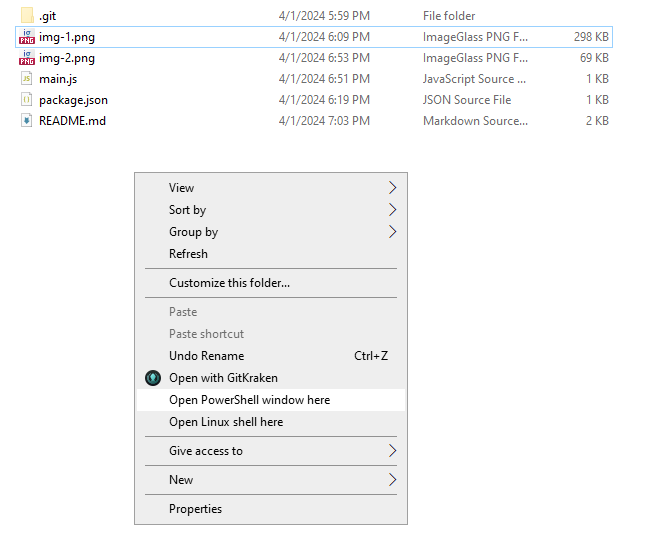

# Discord April Fools 2024

**Preface:** These instructions are primarily for Windows users. If you are using Linux, then you are obviously smart enough to translate them to the "Linux version" for yourself because I'm too lazy to write a Linux version

1) Download the [latest version of Node.js](https://nodejs.org/en/download) and install it. Be sure to add it to your PATH!

2) Open up Discord in your browser and navigate to the place where you will open up loot boxes, which is User Settings `->` Loot Boxes

3) Open up the developer tools and make sure that you're on the `Network` tab with the `Fetch/XHR` chip selected to make it easier for you

4) Click on the button `Open a new box!`

5) You will see a new row created with the name of `open`. Right-click on it and select `Copy` `->` `Copy as fetch (Node.js)`

6) Go to the code `main.js` and paste what you just copied, replacing `PASTE_THE_CLIPBOARD_HERE` with it

7) Your `main.js` file should look something like the below image

**NOTE:** I've censored important information that can be used to steal your Discord session! DO NOT SHARE THIS WITH ANYBODY OR ELSE YOUR ACCOUNT WILL GET COMPROMISED!

8) Open up PowerShell in the directory where `main.js` is. You can easily do this by holding down the shift key and the right clicking in the folder. See the image below:

9) Once PowerShell is open, type the command `node main.js` and hit the `Enter/Return` key

10) If it looks like the screenshot below, then it's working

